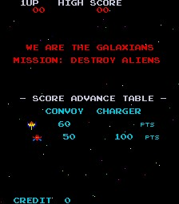

# Hardware

**Galaxian** runs on Namco's 1979 Galaxian board — the base of the Galaxian/Scramble video
family (MAME driver `galaxian/galaxian.cpp`, machine `galaxian`). There is a **single
Zilog Z80** main CPU clocked at **3.072 MHz** (18.432 MHz / 6), giving **50688
cycles/frame** at a **60.606 Hz** refresh; the native raster is 256×224, displayed rotated
90° (MAME `ROT90`, a portrait cabinet).

Galaxian has **no sound CPU and no sample ROM** — the sound is **custom discrete-analogue
hardware** (MAME `galaxian_a.cpp`): the program writes a few registers and the board's
analogue circuitry makes the tones. There is therefore no sound-command latch and no
second processor to feed; the "sound" writes below are register pokes to that circuit.

Three hardware conventions matter when reading the map. (1) **A read and a write at one
address are different devices.** Every input port doubles as an output: a read of `0x6000`
returns IN0 while a write to `0x6000`+ drives the start lamp / coin lines; a read of
`0x6800` returns IN1 while a write drives the sound generator; a read of `0x7800` **kicks
the watchdog** and returns `0xFF` while a write sets the sound pitch. (2) **Inputs are
active-HIGH** — a pressed control reads **1**, and an idle port reads **0** (except IN2,
whose Lives DIP seats a `0x04`). (3) A group of **single-bit control lines are standalone
D0 latches** — one address per line, the state carried on data bit 0 — for the NMI enable,
the star-field enable, the two screen-flip bits, the coin lock and the coin counter.

The only interrupt is a **vblank NMI** (vector `0x0066`). It fires **only while the NMI-enable
latch at `0x7001` is set**; the main loop sets that latch to arm the interrupt each frame and
the interrupt is masked whenever the latch is clear (the reset code clears it first thing).

## Memory & I/O map

>>> memory

| Address | Name | Description |
| --- | --- | --- |
| 0000:3fff | rom | Program ROM (`galaxian` main-CPU parts galmidw.u + galmidw.v + galmidw.w + galmidw.y + 7l; a 0x2800 image zero-padded to 0x4000) |
| 4000:43ff | workRam | Work RAM (see [Work RAM](RAMUse.md)); mirror mask 0x0400 |
| 5000:53ff | videoRam | Video RAM / tilemap (galaxian_videoram_w), one tile code per cell over a 0x20-wide grid; mirror mask 0x0400 |
| 5800:58ff | objRam | Object RAM (galaxian_objram_w): per-column scroll+colour 0x00-0x3F, 8 sprites × 4 bytes 0x40-0x5F, bullets 0x60-0x7F; mirror mask 0x0700 |
| 6000 | in0 / startLamp | R: IN0 (joystick L/R, fire, coins, service). W (D0, reg = A&7): start-lamp / player-1 lamp lines |
| 6002 | coinLock | W (D0): coin lockout |
| 6003 | coinCounter | W (D0): coin counter |
| 6004:6007 | soundLfo | W: discrete sound LFO frequency (galaxian_sound_device lfo_freq_w) |
| 6800 | in1 / soundW | R: IN1 (start buttons, coinage DIP). W 6800:6807: discrete sound generator (sound_w) — tones, noise, shoot, hit |
| 7000 | in2 | R: IN2 (bonus + lives DIPs) |
| 7001 | irqEnable | W (D0): NMI enable — the main loop sets it to arm the vblank NMI, the reset code clears it |
| 7004 | starsEnable | W (D0): star-field enable (the scrolling background stars) |
| 7006 | flipX | W (D0): screen flip X (cocktail) |
| 7007 | flipY | W (D0): screen flip Y (cocktail) |
| 7800 | watchdog / soundPitch | R: watchdog reset — the read pets the dog and returns 0xFF. W: discrete sound pitch (pitch_w) |

## IN0 — joystick L/R, fire, coins, service (read at 0x6000, active-high, idle 0x00)

| Bit | Mask | Input |
| --- | --- | --- |
| 0 | 0x01 | Coin 1 |
| 1 | 0x02 | Coin 2 |
| 2 | 0x04 | Left (2-way) |
| 3 | 0x08 | Right (2-way) |
| 4 | 0x10 | Fire (button 1) |
| 5 | 0x20 | DIP: cabinet (0 = upright default; set = cocktail) |
| 6 | 0x40 | Service |
| 7 | 0x80 | Service coin |

## IN1 — start buttons + coinage DIP (read at 0x6800, active-high, idle 0x00)

| Bit | Mask | Input |
| --- | --- | --- |
| 0 | 0x01 | Start 1P |
| 1 | 0x02 | Start 2P |
| 2 | 0x04 | Left (cocktail) |
| 3 | 0x08 | Right (cocktail) |
| 4 | 0x10 | Fire (cocktail) |
| 6–7 | 0xC0 | DIP: coinage (default 0x00 = 1 coin / 1 credit) |

Galaxian has **no standalone DSW port**: the dip switches are interleaved into IN1 and IN2.

## IN2 — bonus + lives DIPs (read at 0x7000, active-high, idle 0x04)

| Bit | Mask | Input |
| --- | --- | --- |
| 0–1 | 0x03 | DIP: bonus life (default 0x00 = 7000) |
| 2 | 0x04 | DIP: lives (default set = 3) |

The Lives-default bit seats `0x04` in this port, which is why the idle read is `0x04`, not `0x00`.

## Standalone D0 control latches (one address per line, data on bit 0)

Each of these single-bit lines is written as its own address, taking the value on data bit 0
(the decode masks the address, so mirrors resolve to the same latch).

| Address | Line |
| --- | --- |
| 7001 | NMI enable (the main loop writes 1 to arm the vblank NMI; the reset code clears it) |
| 7004 | Star-field enable (the drifting background star layer) |
| 7006 | Screen flip X (cocktail) |
| 7007 | Screen flip Y (cocktail) |
| 6002 | Coin lockout |
| 6003 | Coin counter |

## Video — tilemap, sprites, bullets, and stars

The display is a Galaxian-family tilemap plus an object layer, over a hardware star field.
**Video RAM** at `0x5000`–`0x53FF` holds one tile code per cell across a 0x20-wide grid
(drawn rotated). **Object RAM** at `0x5800`–`0x58FF` is three regions in one page: the first
0x40 bytes are **per-column scroll and colour** (column N takes its scroll from
objRam[N×2]); `0x40`–`0x5F` are the **eight hardware sprites** of four bytes each (the
player ship and the diving aliens); and `0x60`–`0x7F` is the **bullet region** (the player
shot and the aliens' dropped bombs). Each sprite record decodes as: **byte0** → position on
one axis; **byte1** → tile `code & 0x3f` plus flip-X (0x40) / flip-Y (0x80); **byte2** →
colour; **byte3** → the other axis. The graphics come from two 0x800 bitplane ROMs (8×8
characters and 16×16 sprites decode from the same data); the palette is a single 32-byte
colour PROM (a 32-entry palette, no lookup PROMs). The **star field** is generated in
hardware (a shifting pseudo-random pattern), gated by the `0x7004` enable latch.
