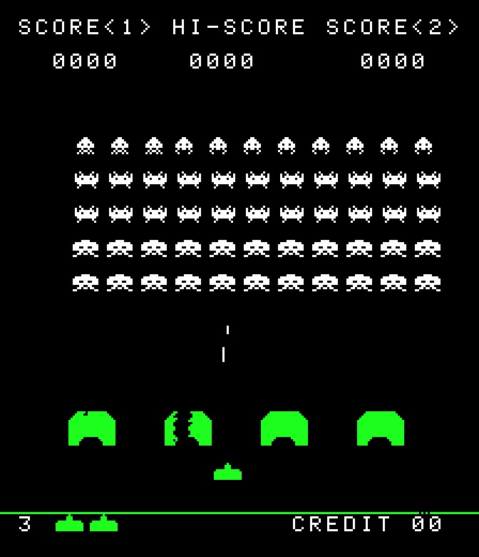

# Hardware

**Space Invaders** runs on the Midway/Taito **mw8080bw** monoboard (MAME driver
`midw8080/mw8080bw.cpp`, machine `invaders`). The CPU is an **Intel 8080** clocked at
**1.9968 MHz** (a 19.968 MHz master crystal / 10), and the display refreshes at
**59.54 Hz** (pixel clock / HTOTAL / VTOTAL), about **33,536 cycles per frame**. The native
raster is 256×224, shown rotated into portrait (MAME `ROT270`).

There is **no second CPU and no sound ROM.** All sound is **discrete analog** — a bank of
circuits switched on and off by two output ports — so what the program does is raise and
lower signal bits, not play samples. Sprite rotation is helped by one custom chip, the
**MB14241 bit-shifter** (see below), which the CPU reaches over the 8080's I/O port space.

Unlike the memory-mapped Konami boards, the devices here live on the **8080 IN/OUT port
space**, reached with `IN n` / `OUT n`, separate from the memory bus. There are eight ports:
three inputs, the shifter, the two sound latches, and the watchdog.

Execution enters the main CPU at three points — the **reset vector** (`0x0000`) and two
maskable interrupts per frame (enabled by `EI`, blocked by `DI`): a **mid-screen** RST at
`0x0008` (RST 1) and a **vblank** RST at `0x0010` (RST 2). The board computes which vector
to deliver from a vsync-chain counter, firing RST 1 near mid-screen and RST 2 at the start of
vblank. Everything time-critical hangs off those two interrupts; the main loop waits on a
frame counter the vblank interrupt decrements.

## Memory & I/O map

>>> memory

| Address | Name | Description |
| --- | --- | --- |
| 0000:1fff | rom | Program ROM, 8192 bytes (`invaders` parts invaders.h + invaders.g + invaders.f + invaders.e at 0x0000/0x0800/0x1000/0x1800) |
| 2000:23ff | workRam | Work RAM (see [Work RAM](RAMUse.md)) |
| 2400:3fff | videoRam | Video RAM — a 1bpp bitmap framebuffer, 7168 bytes (format below) |
| IN 0 | in0 | R: input port 0 — largely unused on the shipped game (pull-ups) |
| IN 1 | in1 | R: input port 1 — coin, start, and player-1 controls (bit table below) |
| IN 2 | in2 | R: input port 2 — DIP switches, tilt, and player-2 controls (bit table below) |
| IN 3 | shiftResult | R: MB14241 shifted result — the 8-bit window of the 16-bit register at the current offset |
| OUT 2 | shiftAmount | W: MB14241 shift amount (low 3 bits) |
| OUT 3 | sound1 | W: sound port 1 — one discrete cue per bit (bit table below) |
| OUT 4 | shiftData | W: MB14241 shift data — pushed into the high byte of the 16-bit register |
| OUT 5 | sound2 | W: sound port 2 — the fleet march and the saucer-hit tone (bit table below) |
| OUT 6 | watchdog | W: watchdog reset — any write kicks it |

## IN 1 — coin / start / player 1 (read at port 1)

Active **high** (a pressed bit reads 1), except **coin**, which is active **low**.

| Bit | Mask | Input |
| --- | --- | --- |
| 0 | 0x01 | Coin (active low) |
| 1 | 0x02 | Start 2P |
| 2 | 0x04 | Start 1P |
| 4 | 0x10 | Player 1 fire |
| 5 | 0x20 | Player 1 left |
| 6 | 0x40 | Player 1 right |

Bit 3 is an unused pull-up (reads 1). The idle byte is therefore 0x09 (coin + bit 3, both
active-low pull-ups).

## IN 2 — DIP switches / tilt / player 2 (read at port 2)

The player-2 controls sit in the same bit positions as player 1's, and the cabinet DIP
switches share the port. All DIP-derived bits sit at their default-off idle (0x00 =
3 ships / 1500-point bonus ship / coin-info display on).

| Bit | Mask | Input |
| --- | --- | --- |
| 0–1 | 0x03 | DIP — starting ships: 3 / 4 / 5 / 6 |
| 2 | 0x04 | Tilt |
| 3 | 0x08 | DIP — bonus ship at 1500 (clear) or 1000 (set) |
| 4 | 0x10 | Player 2 fire |
| 5 | 0x20 | Player 2 left |
| 6 | 0x40 | Player 2 right |
| 7 | 0x80 | DIP — coin-info display in the demo |

## MB14241 bit-shifter (ports 2, 4, 3)

A sprite's horizontal position is a pixel coordinate, but the framebuffer is byte-addressed
(eight pixels per byte). The MB14241 does the shift so a sprite can land at any pixel. It
holds a **16-bit register**. Writing a byte to **OUT 4** pushes it into the high half (the
old high byte falls into the low half), so successive writes build a two-byte window.
Writing **OUT 2** sets a **shift amount** of 0–7. Reading **IN 3** returns the 8-bit slice of
the 16-bit register starting `amount` bits down from the top — i.e. `(data << amount) >> 8`.
The blitters write the sprite byte and a zero to OUT 4, then read the two overlapping halves
back from IN 3 to place a byte-wide sprite at an arbitrary pixel column.

## Sound — port 3 (OUT 3)

Each bit switches one discrete circuit; the program keeps a RAM shadow of the port, flips a
bit, and writes the whole byte, so an effect is "raise this bit" / "clear this bit."

| Bit | Mask | Sound |
| --- | --- | --- |
| 0 | 0x01 | Saucer (UFO) — a steady tone, held while the saucer is on screen |
| 1 | 0x02 | Player shot |
| 2 | 0x04 | Player explosion (base hit) |
| 3 | 0x08 | Invader killed |
| 4 | 0x10 | Extra ship awarded |
| 5 | 0x20 | Amplifier enable — gates the analog output; not a sound in itself |

## Sound — port 5 (OUT 5)

| Bit | Mask | Sound |
| --- | --- | --- |
| 0 | 0x01 | Fleet march, note 1 |
| 1 | 0x02 | Fleet march, note 2 |
| 2 | 0x04 | Fleet march, note 3 |
| 3 | 0x08 | Fleet march, note 4 |
| 4 | 0x10 | Saucer hit |

The four march tones are the accelerating heartbeat: the interrupt runs a metronome that
sounds the current note and silences it a few ticks later, and the beat period shortens as
`ALIEN_COUNT` falls, so the fewer aliens remain the faster the march.

## Video RAM — the 1bpp framebuffer

Video memory at `0x2400`–`0x3FFF` is a **one-bit-per-pixel bitmap**, not a tilemap: each byte
holds eight pixels and there is no colour stored in RAM (the cabinet fakes colour with fixed
strips of coloured cellophane over the monochrome tube). The drawing code treats the region
as a grid of **32-byte columns**: stepping the pointer by **+1** moves eight pixels down a
column, and adding **+0x20** crosses into the neighbouring column, so the full width spans
224 columns. Because the display is rotated into portrait, a "column" the code walks down is
a vertical strip on the screen. The bottom-of-screen status line and the top score band are
the two lowest and four highest bytes of every column; `clearPlayfield` steps over those
margins while erasing the playfield between them.
